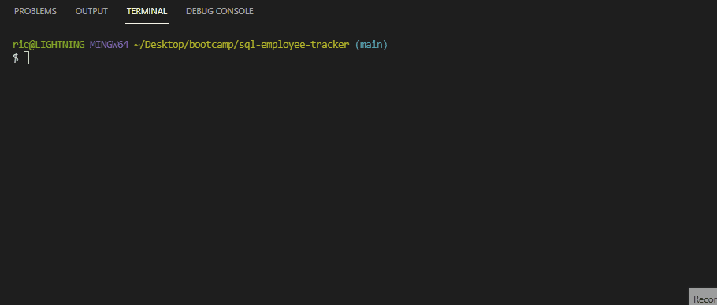

## sql-employee-tracker
This is a node command-line application for managing a company's employee records.

### Prerequisites
* Node
* Inquirer
* MySQL
* console-table

### Install and Use
Run the following commands in the root directory of the application:
* npm install inquirer
* npm install mysql2
* npm install console-table

In the MySQL shell you can run `SOURCE db/content.sql` and `SOURCE db/seed.sql` to initialize or return the database to stock values.

You can then run `node index.js` to execute the file.

### Demo
The following gif demonstrates the functionality of the application.
 

These options are available inside:
* View All Departments
* View All Employees
* View All Employees by Department
* View All Roles
* Add Department
* Add Employee
* Add Role